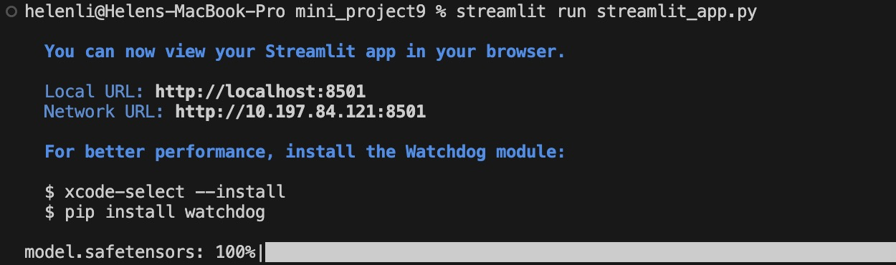

### Streamlit and Transformers Setup
```bash
pip install streamlit
```
```bash
pip install transformers
```
### Create the Streamlit Web Application
Create a Python script streamlit_app.py with the following code:
```python
import streamlit as st
from transformers import pipeline

model = pipeline("text-generation", model="openai-gpt")

def main():
    st.title("Streamlit App with a Hugging Face Model")
    text_input = st.text_area("Enter some text in the input box below, click on the Generate button, and watch the model continue the text for you:")
    
    if st.button("Generate"):
        if text_input:
            generated_text = model(text_input, max_length=50, do_sample=True)[0]['generated_text']
            st.write("Generated Text:")
            st.write(generated_text)
        else:
            st.warning("Please enter some text first.")

if __name__ == "__main__":
    main()
```

### Run Locally
```bash
streamlit run app.py
```


### Deployment on Streamlit

After the deployment is successful, the Streamlit application can be accessed using this URL: